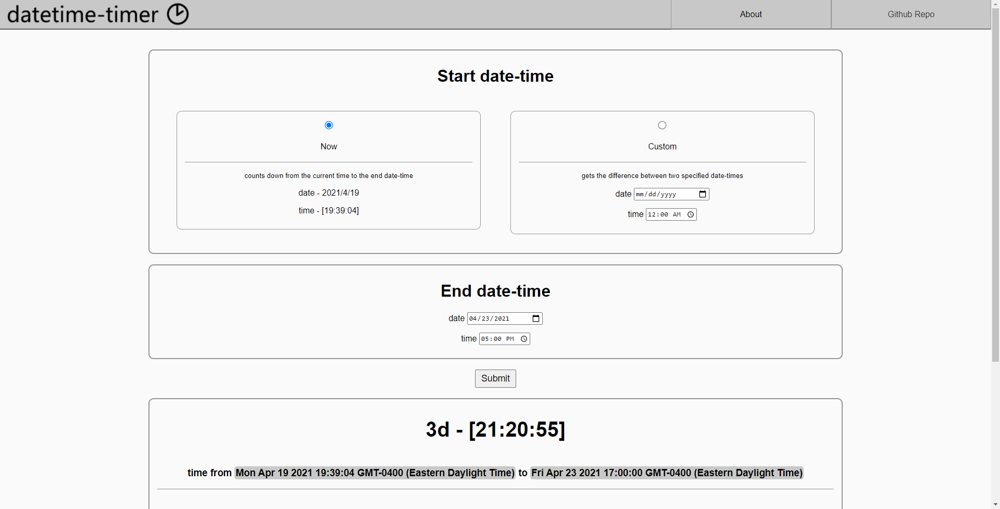
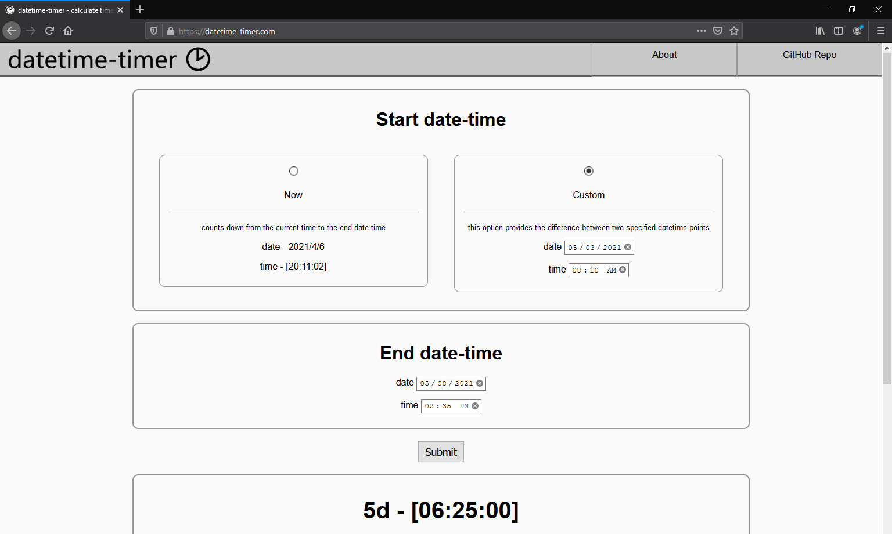
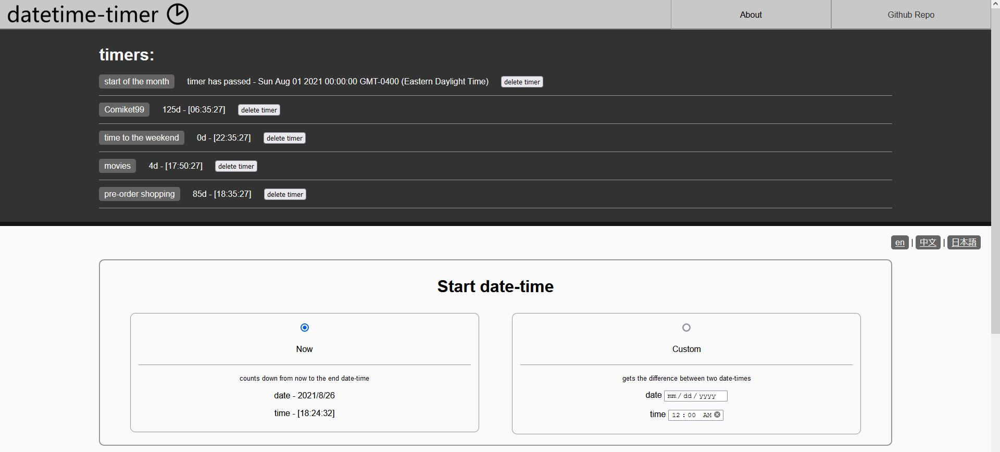
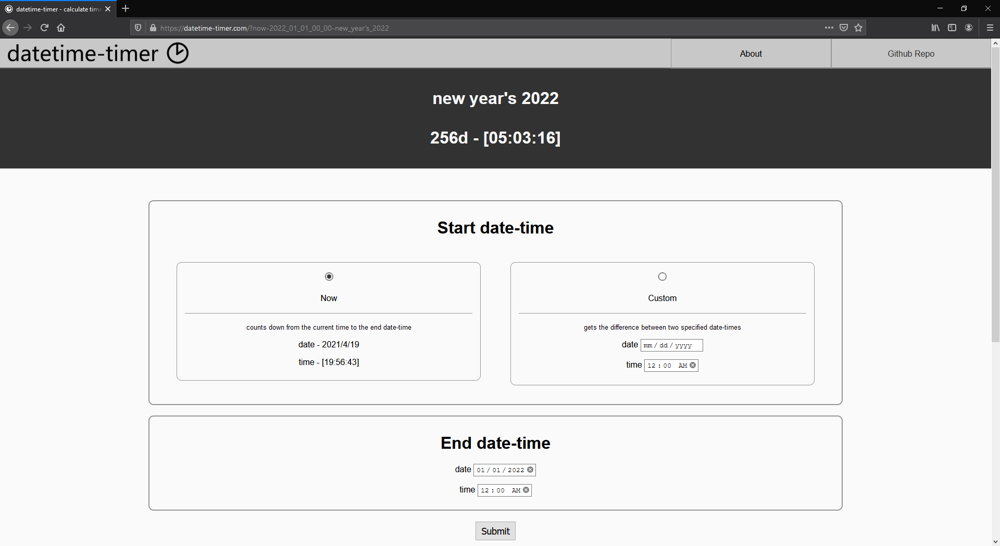

# [datetime-timer.com](https://datetime-timer.com/) | an online tool for timing and calculating between start and end datetimes

-----

## usage
applet can be run in a web browser by checking out the repo and opening `index.html` in a web browser

## features
- display days, hours, minutes, and seconds from current time to specified end date-time
- display time information between two specified datetimes
- generate URL for saving and/or sharing results
- save multiple timers to browser
- responsive styling for mobile

## feature wishlist
- (code) refactoring

## Custom datetime preview:

## Multiple timers saved to browser

## Generated URL with name preview:
- new year 2023 url: <a target='_blank' href='https://datetime-timer.com/?now-2023_01_01_00_00-new_year%27s_2023'>https://datetime-timer.com/?now-2023_01_01_00_00-new_year%27s_2023</a>

